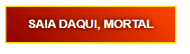

# 🔥 Infernum Buttons — Experiências Interativas Demoníacas

[](https://developer.mozilla.org/pt-BR/docs/Web/HTML)
[](https://developer.mozilla.org/pt-BR/docs/Web/CSS)
[](https://developer.mozilla.org/pt-BR/docs/Web/JavaScript)
[](LICENSE)
[](https://github.com/S-carlord/infernum-buttons/stargazers)

Este repositório contém uma coleção temática de **botões infernais** criados com HTML, CSS e JavaScript puro, inspirados no universo sombrio de _Diablo IV_. Inclui também uma página demonstrativa com narrativa interativa, sons demoníacos e efeitos visuais avançados.

---

## 🎮 Demonstração Online

Veja o projeto em ação [aqui](https://s-carlord.github.io/infernum-buttons/)!

## 📸 Visualização



## 📁 Estrutura do Projeto

```
📦 infernum/
├── App/
│   ├── hellpageV2.html  # Página principal da aplicação completa
│   ├── hellpageV2.html  # Estilos customizados da aplicação
│
├── infernum-btn.html    # Botão isolado, autocontido
├── README.md            # Este arquivo
├── LICENSE              # Arquivo da licença MIT
├── assets/              # Imagens e outros recursos (ex.: GIF de demonstração)
```

### 🧪 Demonstração

#### 🔘 infernum-btn.html

Um botão visualmente intenso com:

- Gradiente flamejante 🔥
- Borda dourada mágica ✨
- Efeito de brilho contínuo 🌟
- Ação de clique com alerta dramático

#### 🌋 page.html

Uma experiência imersiva e interativa com:

- Background sombrio de Diablo IV
- Título e subtítulo que pegam fogo e viram cinzas
- Partículas de brasas, chamas e fumaça
- Sons demoníacos, risadas e trilha ambiente
- Narrativa que avança em etapas com apenas 1 clique cada

---

## 🛠️ Como Usar

### ✔️ Usar apenas o botão (infernum-btn.html)

1. Abra o arquivo ou copie seu conteúdo.
2. Cole dentro de sua página onde desejar exibir o botão.
3. O botão exibirá um alerta ao clique:  
   **"VOCÊ INVOCOU O DEMÔNIO DO CSS!"**
4. Você pode personalizar a ação do clique, cores e animações.

### ✔️ Usar a página completa (page.html)

1. Abra `page.html` em qualquer navegador moderno.
2. Explore a sequência interativa:
   - **Clique 1** → fogo nas letras + trilha demoníaca
   - **Clique 2** → mudança de frase e provocação
   - **Clique 3** → destruição da página e risada final 😈

---

## 📦 Requisitos

- ✅ Nenhuma instalação
- 🌐 Dependências externas: TailwindCSS via CDN, Google Fonts e arquivos de áudio hospedados em [inserir fonte, se aplicável]
- 🧠 Compatível com Chrome 90+, Firefox 85+, Edge 90+ e outros navegadores modernos

---

## 📌 Recomendações de uso

- Sites temáticos de games (RPG, terror, fantasia)
- Páginas de erro 404 criativas
- Landing pages com atmosfera obscura
- Campanhas de Halloween 🎃
- Portfólios criativos com dark mode

---

## 📄 Licença

Este projeto está licenciado sob a [Licença MIT](LICENSE). Veja o arquivo LICENSE para mais detalhes.

⚠️ **Nota do autor**:  
Você pode copiar, adaptar e usar os botões onde quiser — mas não finja que foi você quem criou isso sozinho. HAHAHAHA.

---

## 🙋‍♂️ Autor

Criado por **Hyoran Jimenez Castilho**  
🔥 Amante de experiências visuais imersivas, interações provocativas e narrativas com identidade.  
📩 Conecte-se comigo: [GitHub](https://github.com/S-carLord) | [LinkedIn](https://www.linkedin.com/in/hyoran-c-760604364/)

---

## 🤝 Contribuições

Tem ideias para novos botões?  
Quer criar uma versão celestial, glacial ou pixel art?  
Siga estes passos para contribuir:

1. Faça um fork do repositório.
2. Crie uma branch para sua feature (`git checkout -b feature/novo-botao`).
3. Commit suas alterações (`git commit -m 'Adiciona novo botão celestial'`).
4. Envie um pull request.

Abra uma _issue_ ou envie um _pull request_.  
Todos os cultistas do CSS são bem-vindos!
