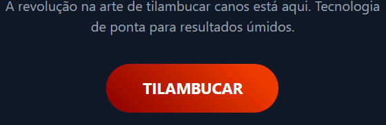

# 💧 Tilambucador 3000 — A Revolução na Arte de Tilambucar Canos

[](https://developer.mozilla.org/pt-BR/docs/Web/HTML)
[](https://developer.mozilla.org/pt-BR/docs/Web/CSS)
[](https://developer.mozilla.org/pt-BR/docs/Web/JavaScript)
[](LICENSE)
[](https://github.com/S-carlord/tilambuquense/stargazers)

A revolução na arte de tilambucar canos está aqui! O **Tilambucador 3000** é uma aplicação web interativa que combina tecnologia de ponta com resultados úmidos e inexplicavelmente divertidos. Este repositório contém o código-fonte da aplicação completa e seu componente base isolado.

---

## 🚀 Demonstração Online

Teste o **Tilambucador 3000** em ação [aqui](https://S-caarlord/tilambuquense/App/)!

## 📸 Visualização



## 📁 Estrutura do Projeto

```
📦 tilambuquense/
├── App/
│   ├── index.html       # Página principal da aplicação completa
│   ├── style.css        # Estilos customizados da aplicação
│   └── script.js        # Lógica e interatividade da aplicação
├── tilambuco-btn.html       # Botão isolado, autocontido
├── README.md            # Este arquivo
├── LICENSE              # Arquivo da licença MIT
├── assets/              # Imagens e outros recursos (ex.: GIF de demonstração)
```

### 🧪 Demonstração

#### 🔘 tilambuco.html

Um botão interativo e autocontido com:

- Animações aquáticas dinâmicas 💦
- Feedback visual em cada clique
- Design simples e reutilizável
- Perfeito para integração em outros projetos

#### 💧 App/index.html

Uma experiência interativa completa com:

- Contador de tilambucadas persistente no navegador
- Efeitos visuais de água (gotas, jatos e respingos) 🌊
- Modais com mensagens de sucesso e desafios
- Design moderno com Tailwind CSS
- Interface fluida e divertida

---

## 🛠️ Como Usar

### ✔️ Usar apenas o botão (tilambuco.html)

1. Abra o arquivo ou copie seu conteúdo.
2. Cole dentro de sua página onde desejar exibir o botão.
3. Personalize as animações, cores e ações do clique conforme necessário.

### ✔️ Usar a aplicação completa (App/index.html)

1. Abra `App/index.html` em qualquer navegador moderno.
2. Explore a experiência interativa:
   - **Clique** → ativa efeitos de água e incrementa o contador
   - **Modais** → mensagens de sucesso e desafios aparecem
   - **Persistencia** → suas tilambucadas são salvas no navegador

---

## 📦 Requisitos

- ✅ Nenhuma instalação necessária
- 🌐 Dependências externas: Tailwind CSS via CDN
- 🧠 Compatível com Chrome 90+, Firefox 85+, Edge 90+ e outros navegadores modernos

---

## 📌 Recomendações de uso

- Sites temáticos de jogos ou experiências interativas
- Páginas de erro 404 com toque de humor
- Landing pages criativas com animações aquáticas
- Projetos educacionais sobre interatividade web
- Portfólios criativos com elementos dinâmicos

---

## 📄 Licença

Este projeto está licenciado sob a [Licença MIT](LICENSE). Veja o arquivo LICENSE para mais detalhes.

⚠️ **Nota do autor**:  
Use, adapte e divirta-se com o Tilambucador 3000 — mas não diga que foi você quem inventou a arte de tilambucar canos! HAHAHA.

---

## 🙋‍♂️ Autor

Criado por **Hyoran Castilho - S-carlord**  
🌃 Apaixonado por interfaces futuristas, estética cyberpunk e interatividade complexa.  
📩 Conecte-se comigo: [GitHub](https://github.com/S-carlord) | [LinkedIn](https://www.linkedin.com/in/hyoran-c-760604364/)

---

## 🤝 Contribuições

Quer adicionar novos efeitos aquáticos ou funcionalidades?  
Siga estes passos para contribuir:

1. Faça um fork do repositório.
2. Crie uma branch para sua feature (`git checkout -b feature/novo-efeito`).
3. Commit suas alterações (`git commit -m 'Adiciona novo efeito de jato d’água'`).
4. Envie um pull request.

Abra uma _issue_ ou envie um _pull request_.  
Todos os tilambucadores são bem-vindos!
